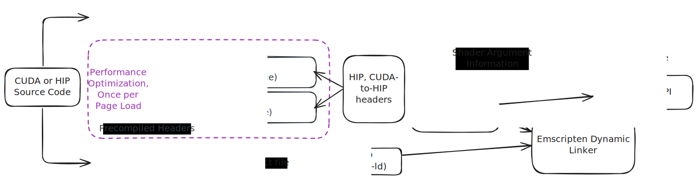
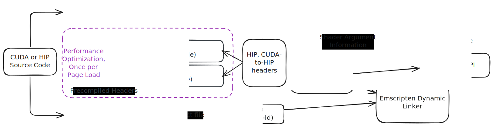

By chaining [chipStar](https://github.com/CHIP-SPV/chipStar/) (a HIP and NVIDIA® CUDA® to OpenCL compiler), [Clspv](https://github.com/google/clspv/) (an OpenCL to Vulkan compiler), and [Tint](https://dawn.googlesource.com/dawn/+/refs/heads/main/src/tint/) (among others, a Vulkan shader to WebGPU shader compiler), you can run CUDA code in the browser!

<a href="https://hipscript.lights0123.com/" target="_blank" rel="noopener" class="xl:col-span-3 py-3 bg-gray-600 flex justify-center items-center text-white bg-gradient-cool font-bold text-3xl">Try it out! ↗</a>

<a href="https://github.com/lights0123/hipscript/" target="_blank" rel="noopener" class="xl:col-span-3 py-3 flex justify-center items-center text-white bg-gray-800 font-bold text-3xl">Source on GitHub ↗</a>


<div class="light-only">


</div>

<div class="dark-only">


</div>

# What is HIP? CUDA?

CUDA is the name of the API developed by NVIDIA for GPGPU (General-purpose computing on graphics processing units). A CUDA compiler compiles the same C++ file twice: once for the GPU architecture, and once for the host. This way, you can share code between them, and all data types remain the same. CUDA also provides library functions for interacting with the GPU and special syntax for launching CUDA kernels.

CUDA kernels are written for one thread, but are then executed by many. Several threads (of the programmer's choice) form a "block", which can share access to fast on-chip memory. There are then some number of blocks in a "grid".

AMD came along and created HIP, their competitor to CUDA. It has identical syntax and concepts to CUDA—just pretty much does `sed s/cuda/hip/g`! This allows projects like chipStar, which allows HIP code to run on any OpenCL-supported device, to provide a header file that `#define`s CUDA calls into HIP ones.

# Supported HIP/CUDA features

This project currently supports a **very basic** subset of HIP and CUDA. However, the supported subset already provides a fair bit of material for learning GPU programming:

- Basic kernel launch syntax
  - C++ is fully supported, so use generic kernels as you please! The compiler will analyze calls from the CPU side to determine what functions must be generated.
- Static and dynamic shared memory
- `__syncthreads` (as long as it's in a uniform control flow path, i.e. no early returns or if statements based on `threadIdx`)
- `printf` (format string and values are written to a hidden buffer by the GPU, then formatted by the CPU afterwards)
- `assert` (although Tint doesn't allow `__syncthreads` afterwards due to [an overzealous control-flow checker](https://github.com/gpuweb/gpuweb/issues/3479#issuecomment-1467271026))
- `hipMalloc`, `hipFree`, `hipMemcpy`, `hipGetSymbolAddress`, `hipMemcpyToSymbol`, `hipLaunchKernel`, `hipLaunchKernelGGL`, `hipGetLastError`, `hipPeekAtLastError`, `hipGetErrorName`, `hipGetErrorString`
  - and corresponding CUDA functions
- `__device__` and `__constant__` variables (although the latter are treated the same as the former, i.e. read-write)

## Unsupported Features

- any functions not listed above
  - streams
  - graphs
  - managed/asynchronous memory transfers
- 64-bit floating point (WebGPU limitation) and 16-bit floating point (Tint limitation) numbers
- integers other than 32-bit signed and unsigned integers (WebGPU limitation)
- many things with pointers:
  - passing a pointer to a kernel not directly as a parameter (e.g. in a struct)
  - **pointer manipulation on the CPU side**: note this means that you cannot pass an offset to `hipMemcpy` or a kernel
    - WebGPU would allow a 128-byte aligned offset passed to a kernel. However, I decided not to implement that because of the limited 32-bit address space of WASM.
- warp intrinsics (should be possible, although currently requires experimental Chrome flags)
- dynamic parallelism (could be polyfilled by converting calls to writes in a buffer, then launching kernels from the CPU)
- any GPU libraries: cuDNN, cuBLAS, cuRAND, ...
- Cooperative Groups
- Inline PTX ([although it has been done before](https://github.com/CHIP-SPV/chipStar/discussions/904#discussioncomment-10255598))

# How it's built

Using LLVM compiled to WebAssembly, the input source code is first passed through Clang, which already understands HIP and CUDA. These languages are compiled in two passes—for the GPU using SPIR-V and for the CPU using WebAssembly. These use WebAssembly headers, meaning all types are the same size. Then, the GPU side code is fed through chipStar, a HIP-to-OpenCL translator. I keep its output as LLVM bitcode to immediately pass through Clspv, converting it to a Vulkan shader. Finally, Google's Tint from the Dawn project translates it to WGSL. A WebAssembly implementation of the HIP API then coordinates kernel launches.

I aimed to keep file size in mind. To package as large of a project LLVM is, I wanted to make sure I wasn't duplicating any code—for example, the WASM backend code shouldn't exist separately in the compiler and linker. This is traditionally done with dynamic linking, which isn't supported by Wasmer (it is by Emscripten, but by going through a JS intermediate: slow). Thankfully, LLVM has an option just for this case: `LLVM_TOOL_LLVM_DRIVER_BUILD`. By setting this flag, LLVM creates a single entrypoint that statically links to every executable. This way, you can just pass the desired tool as arg0 or arg1, like `llvm clang++ file.cpp`.

I then bundled the chipStar LLVM passes in the LLVM source code. I added a command-line flag that allows Clang to run the passes. Typically they're run with `opt`, but that isn't compatible with the driver. Clspv and SPIRV-Tools were added as `LLVM_EXTERNAL_PROJECTS` to be additionally integrated in the single tool.

# Issues I encountered

## Wasmer Runtime Workarounds

I compiled LLVM using the WASIX toolchain, because it offers much needed functions not available in vanilla WASI, and Emscripten doesn't feel great for porting traditional command-line applications. However, the Wasmer SDK is the only implementation of the WASIX specification, and the JS version has some bugs. [You can't load a WASM file directly](https://github.com/wasmerio/wasmer-js/issues/407), loading their "webc" container directly just failed with a generic `Unreachable` error, and the recommended Wasmer CDN doesn't compress files—even when a 5x compression ratio is possible. This large file size then causes Chrome to not cache anything at all! So, I set the "API endpoint" of the CDN to a simple `file:` URI that points to a `blob:` URI for the actual WASM file. On the page load, I handle downloading and caching the binary manually.

Then, I was running into issues where I'd get another generic `Unreachable` after launching more than a couple programs. I worked around this by just spawning new Web Workers and completely re-loading the SDK in each. Very thankfully, it seems like Chrome caches `WebAssembly.compile` calls with the same binary input so there isn't too much of a performance penalty.

I couldn't debug these issues because [the Wasmer SDK source is currently unable to be built](https://github.com/wasmerio/wasmer-js/issues/437) and the package on NPM doesn't ship with debug symbols.

## Compressed Data on Cloudflare R2

GZip compression brought by LLVM bundle from 75MB to 21MB, and Brotli further to 15MB. I decided to use Brotli because of these savings, and it's supported on all modern browsers. I decided to use Cloudflare R2 as my storage provider, on which [others have had success uploading pre-compressed data to](https://alexi.sh/blog/2023/03/using-r2-to-store-and-serve-compressed-content/) since it won't compress to Brotli for you. However, I was encountering issues with the upload step, since rclone was detecting an incorrectly-sized upload. Turns out, you need to specify `Cache-Control: no-transform`. That has the bonus of correctly supporting custom domains with R2 (strongly encouraged for production), since it tells Cloudflare not to uncompress the data, bypassing the entire purpose of doing this.

```
rclone copyto --progress --header-upload "Content-Type: application/octet-stream" --header-upload "Content-Encoding: br" --header-upload "Cache-Control: no-transform" $file $connection:$bucket/$serverpath
```

Before I discovered that, I used gdb to set a breakpoint on `github.com/rclone/rclone/fs/operations.(*copy).removeFailedCopy` to stop deleting the (sucessfully, but it didn't know that) uploaded file.
